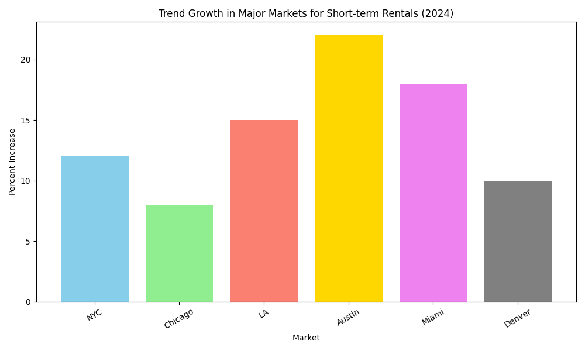

# Short-term Rentals Insights Report 2025

## Emerging Markets
The short-term rental industry is experiencing significant growth in secondary cities and rural areas. Travelers are increasingly looking towards these destinations to find unique experiences while avoiding overcrowded, popular destinations. This trend is driven by the desire to explore less-traveled paths and to immerse in local cultures, which is encouraging investment opportunities in these budding markets for those willing to look beyond traditional urban hubs.

## Sustainability Focus
There is a growing demand for eco-friendly short-term rentals as consumers become more environmentally conscious. This has led to the development of more sustainable practices within the industry, such as the use of renewable energy sources, waste reduction strategies, and green building materials. These eco-conscious measures not only attract environmentally aware travelers but also serve to differentiate properties in a competitive marketplace, presenting a valuable proposition for investors aiming to appeal to this segment of the market.

## Tech Integration
The integration of smart technology in short-term rental properties is rising, with more hosts leveraging innovations to enhance guest experiences and automate property management. From smart locks to app-controlled lighting and heating, these technologies offer convenience and efficiency for both hosts and guests. This technological shift not only improves operational effectiveness but also appeals to tech-savvy travelers, positioning tech-enhanced properties as prime investment opportunities.

## Variable Pricing Models
Dynamic pricing models have become increasingly prevalent in the short-term rental market as platforms and hosts strive to optimize occupancy rates. By analyzing demand patterns, hosts can adjust their pricing strategy to capture maximum revenue—raising prices during peak demand and offering discounts during slower periods. For investors, understanding and adopting these pricing strategies is crucial to maximizing return on investment in this highly competitive environment.

## Luxury Segment Growth
There is an observable increase in the demand for luxury rentals that offer unique amenities and personalized services. Wealthier travelers are looking for experiences that go beyond simple accommodations, seeking properties that offer exclusivity and high-end comforts. This trend is particularly strong in major cities like New York, where there has been a 12% increase in luxury rentals. Investments in this segment can yield significant returns if properties are able to meet the discerning tastes of affluent guests.

## Regulatory Changes
Major cities are implementing new regulations that impact short-term rental listings, prompting more hosts to consider expanding into secondary markets. This shift requires careful navigation of legal landscapes but also opens opportunities for investors to tap into markets with less regulation and increased potential for growth. Keeping abreast of these changes and adapting strategies accordingly will be imperative for maintaining compliance and optimizing business performance.

## Remote Work Trend
The 'workcation' trend continues to gain momentum as remote workers seek to blend work with leisure. Properties offering strong connectivity and work-friendly environments are in high demand, allowing workers to function efficiently from desirable locations. This shift presents robust investment prospects in properties equipped to accommodate the needs of remote professionals, potentially increasing booking rates and extending stays.

## Extended Stays
The preference for extended stays is on the rise as travelers combine business trips with leisure. Data shows cities like Miami are experiencing an 18% increase in bookings for longer periods. This trend encourages a stable income stream for property owners, as longer bookings can minimize turnover and maximize occupancy rates. Investors and hosts who cater to this trend by providing attractive amenities for long-term guests stand to benefit from this evolving market dynamic.

## Visualizing Market Trends

The chart above highlights the percent increase in market trends for short-term rentals across various cities, providing a clear visual representation of key growth areas and emerging opportunities. This visual tool can assist investors in identifying which markets are ripe for investment and require strategic focus for 2025.
