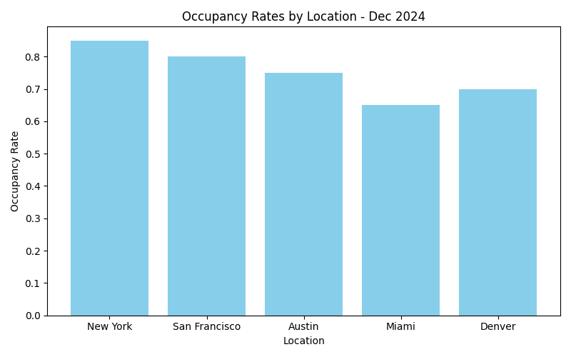
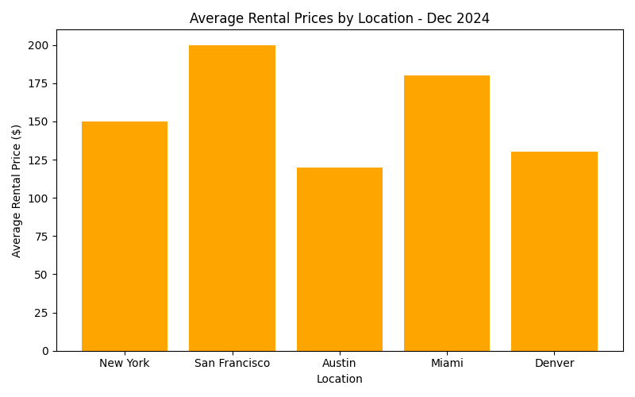

# Short-term Rental Market Insights Report – December 2024

## Introduction
The short-term rental market in 2024 has been dynamic, responding to evolving consumer behaviors and shifting economic conditions. As we progress into 2025, understanding these trends is crucial for making informed investment decisions. This report provides a comprehensive analysis of key trends affecting the market and identifies potential investment opportunities.

## Key Sources of Data
Our insights are derived from several key sources to ensure comprehensive market coverage. These include comprehensive Real Estate Market Reports, Industry Podcasts providing expert opinions, and analytical data from short-term rental platforms to track bookings and pricing trends in real time.

## Current Trends
### Occupancy Rates
Throughout 2024, we have observed a notable increase in occupancy rates across major urban centers. For instance, New York and San Francisco have seen occupancy rates of 85% and 80% respectively. These trends highlight the return of business and leisure travelers to cities. However, seasonal fluctuations continue to impact beachside rentals, indicating opportunities for strategic timing of investments in such locations.

### Average Rental Prices
Average nightly rates have seen an upward trend in metropolitan areas such as San Francisco, where average rates are $200. Touristic cities are demonstrating substantial price elasticity, aligning with tourism's gradual rebound. These trends suggest favorable conditions for investments in urban rentals, especially where demand is anticipated to outpace supply.

### Geographic Locations Showing Growth
Urban short-term rentals are experiencing a revival post-pandemic, especially in cities with strong economic infrastructure. Additionally, there is significant growth in locations conducive to remote work lifestyles, primarily fueled by digital nomads. This trend is particularly pronounced in cities like Austin and Denver, which offer attractive quality of life and favorable business climates.

## Conclusion
Investors should prioritize emerging urban areas with robust infrastructure developments for high returns on investment. As these areas continue to grow, they present optimal conditions for acquiring properties expected to appreciate rapidly.

## Recommendations
To maximize returns, investors are encouraged to explore under-the-radar urban markets experiencing infrastructural development. Diversification remains paramount; thus, a balanced portfolio containing both city-centric and remote-friendly rentals can hedge against market volatility. Monitoring trends and adapting to changes rapidly will be key to sustaining competitive advantages in the short-term rental market.
