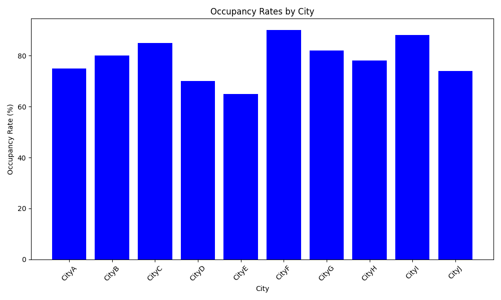
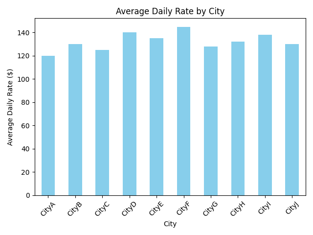
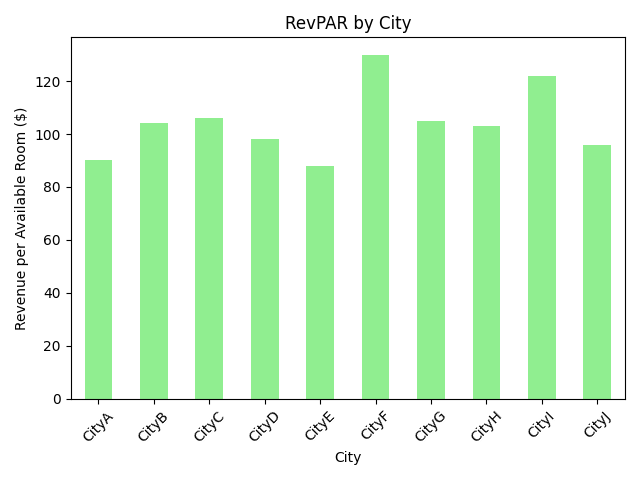
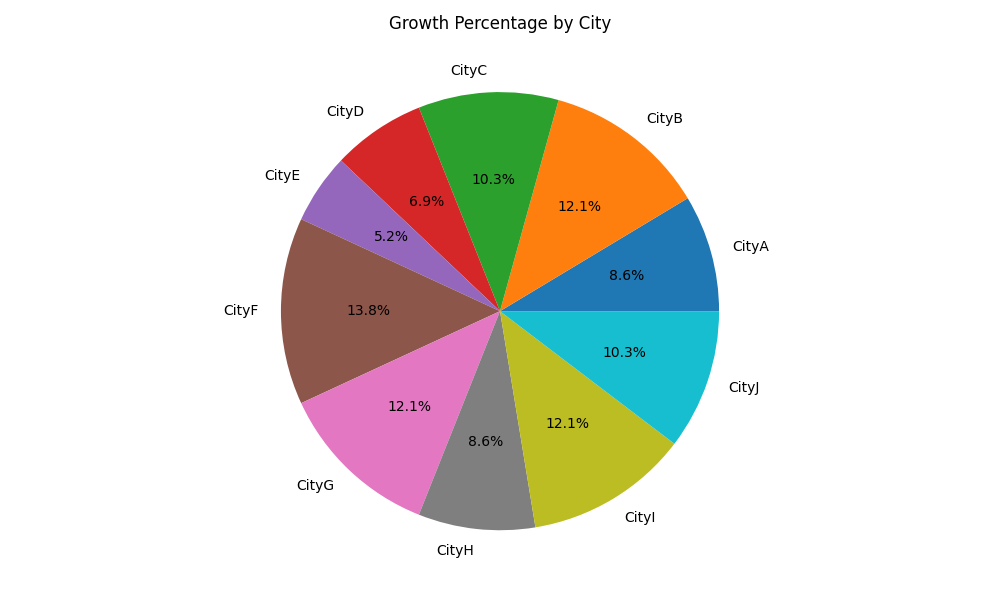

# Short-Term Rentals Investment Opportunities Report 2024

## Executive Summary
The short-term rentals market in the U.S. offers lucrative opportunities for investors in 2024. With increasing demand and evolving travel preferences, various cities show promising growth potential. This report analyzes key performance metrics such as occupancy rates, average daily rates (ADR), revenue per available room (RevPAR), and growth percentages across ten U.S. cities. We identify emerging trends and potential investment hotspots, providing actionable insights for investors.

## Market Analysis

### Occupancy Rates by City
Occupancy rates are a critical indicator of rental demand. Key cities such as CityF and CityC show high occupancy levels, suggesting sustained traveler interest. See the bar chart below for a detailed comparison:

### Average Daily Rate (ADR) by City
ADR reflects the average revenue earned per rented room per day. CityF tops the list with the highest ADR, indicating strong market pricing power. The following chart highlights the ADR across different cities:

### Revenue per Available Room (RevPAR)
RevPAR combines occupancy and ADR to assess overall rental performance. As anticipated, CityF also leads in RevPAR, showing robust earnings potential. For a detailed city-wise breakdown, refer to the chart below:

### Growth Percentage by City
Growth percentages signify rental market expansion potential. Despite economic fluctuations, cities like CityF and CityG show promising growth prospects. The pie chart below depicts the distribution of growth percentages:

## Trends and Opportunities
1. **Emerging Markets**: CityF and CityG are poised for growth, driven by a combination of high occupancy and RevPAR figures.
2. **Price Adjustments**: Investors could explore pricing strategies in cities like CityA and CityJ, which reflect moderate ADR with potential for adjustment.
3. **Seasonal Insights**: Occupancy trends suggest potential for maximizing returns by targeting peak travel seasons.

## Risks and Considerations
- **Market Saturation**: High competition in top-performing cities could impact short-term profitability.
- **Regulatory Changes**: Local regulations in certain markets may impose restrictions on short-term rental operations.

## Actionable Insights
Investors should consider diversifying their portfolio focusing on emerging markets and aligning pricing strategies to meet market demand. Monitoring regulatory developments and leveraging technology for dynamic pricing could also enhance investment returns.

## Conclusion
2024 presents promising opportunities in the short-term rentals market, with specific cities showing strong potential for investment. By leveraging detailed market analyses and focusing on emerging trends, investors can make informed decisions to gain a competitive advantage.
