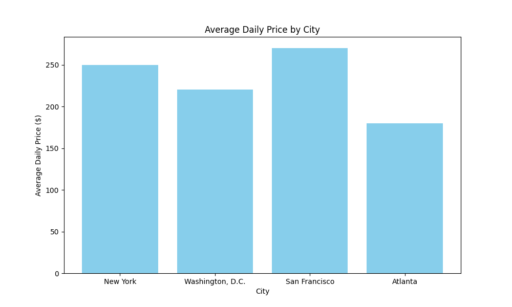
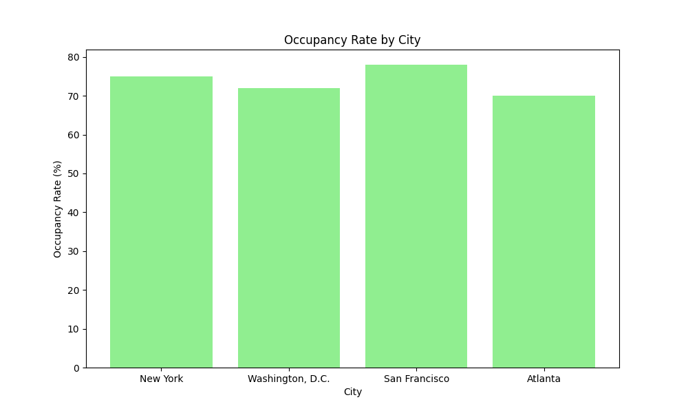
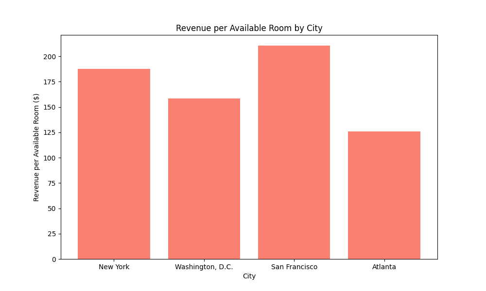

# 2025 U.S. Short-Term Rental Market Investor Report

## Market Trends and Insights

The U.S. short-term rental market is poised for significant growth in 2025, with demand expected to increase by 4.9%, surpassing the supply growth of 4.7%. This trend is particularly evident in urban markets such as New York, Washington, D.C., San Francisco, and Atlanta. These cities are anticipated to experience gains in occupancy and revenue per available room (RevPAR), driven by limited supply growth and regulatory constraints. As urban areas continue to attract travelers, investors can expect stable returns in these high-demand locations.

## Promising Cities for Investment

Investors looking to capitalize on the short-term rental market should consider focusing on cities with high occupancy rates and limited new supply. New York, for instance, boasts high occupancy rates, with regulatory constraints further limiting new supply. Washington, D.C. offers steady demand growth with minimal new supply, making it an attractive option for investors. San Francisco presents strong RevPAR growth potential, while Atlanta benefits from increasing demand and stable economic conditions. These cities offer promising opportunities for investors seeking to maximize returns.

## Key Metrics by City

Key metrics such as average daily price, occupancy rate, and revenue per available room vary by city, with urban areas generally commanding higher rates. New York leads with an average daily price of $250, followed by San Francisco at $270. Occupancy rates are expected to stabilize and grow in major urban markets, with San Francisco leading at 78%. Revenue per available room is projected to increase in key cities as demand continues to outpace supply, offering lucrative opportunities for investors.

## Economic Indicators

The economic conditions in 2025 are expected to support the growth of the short-term rental market. Rising real incomes and steady economic conditions will likely bolster demand growth. Although interest rates are projected to remain high, stronger cash flow and home value appreciation provide substantial investment opportunities. Investors should consider these economic indicators when evaluating potential investments in the short-term rental market.

## Sources

1. [AirDNA 2025 Outlook Report](https://www.airdna.co/outlook-report)
2. [Hotel News Resource](https://www.hotelnewsresource.com/article134372.html)
3. [US News Money - Best Places to Invest in Real Estate](https://money.usnews.com/investing/articles/best-places-to-invest-in-real-estate)

This report provides a comprehensive overview of the U.S. short-term rental market for 2025, highlighting key trends, promising investment areas, and essential metrics for investors. By leveraging these insights, investors can make informed decisions to capitalize on the opportunities within the market.